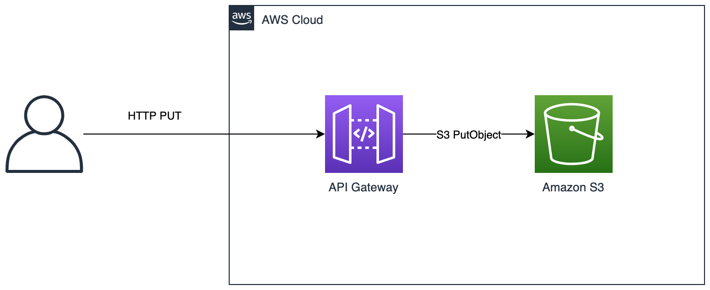

# Workflow



- 1. Create a S3 bucket
- 2. Create a REST API endpoint using API Gateway with above s3 bucket as backend
- 3. PUT an object into the s3 bucket with the REST API endpoint

## 1. Create a S3 bucket

`cat .env`

```bash
REGION="<your-region>"
AWS_ACCOUNT_ID="<your-account_id>"
```

```bash
source .env
export your_region=$REGION
export your_account_id=${AWS_ACCOUNT_ID}
```

```bash
### bucket names have to be globally unique
TEST_BKT=$USER-$AWS_ACCOUNT_ID-test-bkt-name

### do not see a need for any one else to read the bucket, hence private 
## will give separate permission to the API Gateway to do put object, delete object
acl=private

aws s3api create-bucket --bucket $TEST_BKT --region $REGION --acl $acl --create-bucket-configuration LocationConstraint=$REGION
```

## 2. Create a REST API (OR) Use an existing REST API

### Create the IAM Role for API GW

```bash
APIGW_ROLE_NAME=API_GW_ROLE_FOR_S3
APIGW_TRUST_POLICY_JSON=apigw_trust_policy.json

aws iam create-role --role-name $APIGW_ROLE_NAME --assume-role-policy-document file://${APIGW_TRUST_POLICY_JSON}


aws iam attach-role-policy --role-name $APIGW_ROLE_NAME --policy-arn "arn:aws:iam::${AWS_ACCOUNT_ID}:policy/${APIGW_POLICY_NAME}"

APIGW_ROLE_ARN=$(aws iam get-role --role-name $APIGW_ROLE_NAME --query "Role.Arn" --output text)
```

- Skip the step if you have created the REST_API_ID

```bash
API_NAME=REST_API__FOR_S3
REST_API_ID=$(aws apigateway create-rest-api --name $API_NAME --region ${your_region} --endpoint-configuration types=REGIONAL --query 'id' --output text) 
```

- OR

`REST_API_ID=<your-rest-api-id>`

# aws apigateway import-rest-api --body file://openapi_configs/restapi_for_S3_put_3.yaml`

```bash
sed -e "s|\${AWS_ACCOUNT_ID}|${AWS_ACCOUNT_ID}|g" -e "s|\${REGION}|${REGION}|g" -e "s|\${APIGW_ROLE_ARN}|${APIGW_ROLE_ARN}|g" restapi_for_s3_put_3_template.yaml > restapi_for_s3_put_3_final.yml

aws apigateway put-rest-api --rest-api-id $REST_API_ID --body file://restapi_for_s3_put_3_final.yml --mode merge

STAGE_NAME=v1
aws apigateway create-deployment --rest-api-id $REST_API_ID --stage-name $STAGE_NAME --region $REGION


myresource=${TEST_BKT}
api_gw_url=https://${REST_API_ID}.execute-api.${REGION}.amazonaws.com/${STAGE_NAME}/${myresource}

curl -X PUT -d @example_json.json $api_gw_url/example_json.json
curl -X PUT -d @test_event.json $api_gw_url/test_event_for_pii_de-identification.json
```
