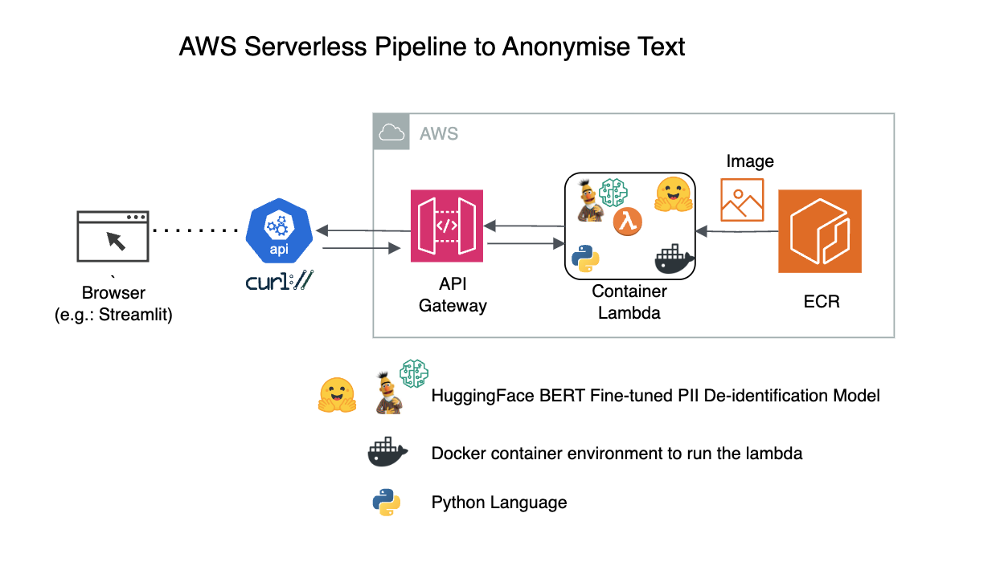

# Steps to create container lambda with api gateway


[image source](https://tud7.medium.com/aws-deploy-lambda-function-with-docker-image-and-invoke-over-https-ae27b137fffc) 

## 0. Initial Environment 


```bash
REGION="<your-region>"
AWS_ACCOUNT_ID="<your-account_id>"
```


## 1. Create a docker
### A. Prepare Dockerfile, create docker container locally, test the container locally
`sudo docker buildx build --platform linux/arm64 -f Dockerfile . -t presidio_text_anonym_ab_pii:7May`

- To test the lambda container locally


```bash
% cat test_event.json 

{
  "text_to_be_masked": "Hello, my name is Senthil Kumar and I live in Chennai. I work as a software engineer at XYZ. my email id is senthil_kumar@gmail.com. I need to avail refund for a purchase in your site made from the credit card number 5549-8979-6588-8762. Reach me at mobile +91 9876541230"
}

% docker run --rm -ti --platform linux/arm64 -p 9000:8080 presidio_text_anonym_ab_pii:7May

# from the same directory opened in another terminal 
% curl -X PUT -d @test_event.json "http://localhost:9000/2015-03-31/functions/function/invocations" > output.json
% jp -f output.json -u 'body' | jq .

{
  "input_event": {
    "text_to_be_masked": "Hello, my name is Senthil Kumar and I live in Chennai. I work as a software engineer at XYZ. my email id is senthil_kumar@gmail.com. I need to avail refund for a purchase in your site made from the credit card number 5555555555554444. Reach me at mobile +91 9876541230"
  },
  "annonymized_output": "Hello, my name is <FIRSTNAME> <LASTNAME> and I live in <CITY> I work as a software engineer at XYZ. my email id is <EMAIL> I need to avail refund for a purchase in your site made from the credit card number <CREDITCARDNUMBER> Reach me at mobile <PHONENUMBER>"
}
```

### B. Push the docker to ECR

```bash
aws ecr get-login-password | docker login --username AWS --password-stdin ${AWS_ACCOUNT_ID}.dkr.ecr.${REGION}.amazonaws.com
ECR_REPO_NAME="anonymize_text"
TAG_NAME="7May_3"

# below command only once when creating the repo in ECR
# aws ecr create-repository --repository-name anonymize_text
docker tag presidio_text_anonym_ab_pii:${TAG_NAME} ${AWS_ACCOUNT_ID}.dkr.ecr.${REGION}.amazonaws.com/${ECR_REPO_NAME}:${TAG_NAME}
docker push ${AWS_ACCOUNT_ID}.dkr.ecr.${REGION}.amazonaws.com/${ECR_REPO_NAME}:${TAG_NAME}
DOCKER_IMAGE_URI="${AWS_ACCOUNT_ID}.dkr.ecr.${REGION}.amazonaws.com/${ECR_REPO_NAME}:${TAG_NAME}"
```

## 2. Create Lambda Function


### A. create iam policy and role for lambda

```bash
POLICY_NAME="container_lambda_iam_policy"
ROLE_NAME="container_lambda_role"
location_of_iam_policy_json_file="container_iam_policy.json"
location_of_trust_policy_json_file="trust_policy.json"
```

```
cd ./codes
aws iam create-policy --policy-name $POLICY_NAME --policy-document file://${location_of_iam_policy_json_file}

aws iam create-role --role-name $ROLE_NAME --assume-role-policy-document file://${location_of_trust_policy_json_file}

aws iam attach-role-policy --role-name $ROLE_NAME --policy-arn "arn:aws:iam::${AWS_ACCOUNT_ID}:policy/${POLICY_NAME}"

IAM_ROLE_ARN=$(aws iam get-role --role-name $ROLE_NAME --query "Role.Arn" --output text)

```


### C. Create Container Lambda && Invoke the Lambda

- Parameters for Container Lambda
```
FUNCTION_NAME="container_lambda_anonymize_text"
MEMORY_SIZE=6144
TIMEOUT=600
ARCHITECTURE=arm64
```

```bash
% aws lambda create-function \
  --function-name ${FUNCTION_NAME} \
  --package-type Image \
  --code ImageUri=$DOCKER_IMAGE_URI \
  --role $IAM_ROLE_ARN \
  --memory-size $MEMORY_SIZE \
  --timeout $TIMEOUT \
  --architectures $ARCHITECTURE

NEW_TAG_NAME="7May_3"
% DOCKER_IMAGE_URI_UPDATED="${AWS_ACCOUNT_ID}.dkr.ecr.${REGION}.amazonaws.com/${ECR_REPO_NAME}:${NEW_TAG_NAME}"

% aws lambda update-function-code \
--function-name ${FUNCTION_NAME} \
--image-uri ${DOCKER_IMAGE_URI_UPDATED}

% EPHEMERAL_STORAGE=5120 #changed from default 512 MB to 5120 MB

% aws lambda update-function-configuration \
--function-name ${FUNCTION_NAME} \
--ephemeral-storage Size=${EPHEMERAL_STORAGE}

# invoke the test_event.json and out the response
% aws lambda invoke \
--function-name "${FUNCTION_NAME}" \
--invocation-type 'RequestResponse' \
--payload file://test_event.json output_aws.json \
&& cat output_aws.json | jq > formatted_output_aws.json && rm output_aws.json

% jp -f formatted_output_aws.json -u 'body' | jq .

{
  "input_event": {
    "text_to_be_masked": "Hello, my name is Senthil Kumar and I live in Chennai. I work as a software engineer at XYZ. my email id is senthil_kumar@gmail.com. I need to avail refund for a purchase in your site made from the credit card number 5555555555554444. Reach me at mobile +91 9876541230"
  },
  "annonymized_output": "Hello, my name is <FIRSTNAME> <LASTNAME> and I live in <CITY> I work as a software engineer at XYZ. my email id is <EMAIL> I need to avail refund for a purchase in your site made from the credit card number <CREDITCARDNUMBER> Reach me at mobile <PHONENUMBER>"
}
```


## 3. Create API Gateway with above Lambda as the backend

`TO_BE_DONE`

## 4. Invoke the API Gateway

`TO_BE_DONE`
