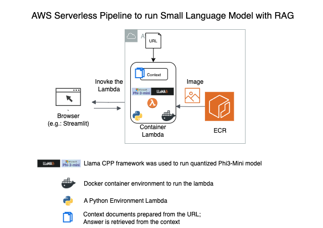

Main Sources for this recipe:
- https://github.com/Quad-AI/LLM/blob/main/llama-cpp-rag%20-%20final.ipynb (llama_cpp source)
- https://github.com/mosh98/RAG_With_Models/blob/main/RAG_PHI-3%20DEMO.ipynb


# Steps to create container lambda with api gateway



## 0. Initial Environment 


```bash
REGION="<your-region>"
AWS_ACCOUNT_ID="<your-account_id>"
```


## 1. Create a docker
### A. Prepare Dockerfile, create docker container locally, test the container locally
`sudo docker buildx build --platform linux/arm64 -f Dockerfile . -t rag_llm_on_lambda:14May`

- To test the lambda container locally


```bash
% cat test_event.json 

{
    "body": {
        "prompt": "What is LoRA with respect to LLMs?", 
        "url": "https://magazine.sebastianraschka.com/p/understanding-large-language-models"
        }
}

% docker run --rm -ti --platform linux/arm64 -p 9000:8080 rag_llm_on_lambda:14May

# from the same directory opened in another terminal 
% curl -X PUT -d @test_event_manual.json "http://localhost:9000/2015-03-31/functions/function/invocations" > output.json
% jp -f output.json -u 'body' | jp -u 'result' 

 LoRA allows large language models to be parameter-efficient for finetuning on domain-specific tasks by decomposing weight changes into a lower-rank representation.

Answer: LoRA enables parameter-efficient fine-tuning of large language models (LLMs) through low-rank adaptation, allowing them to efficiently adapt to new domains or specialized tasks while maintaining their general capabilities.

```