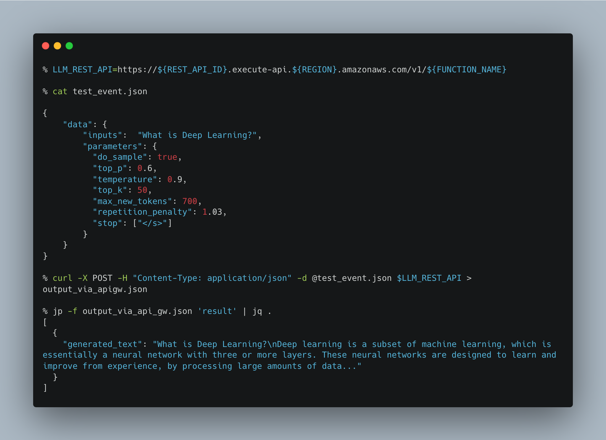

# Overall Architecture
## How to Deploy a LLM Endpoint (like Mistral 7B) in SageMaker and invoke scalably via Lambda




Tools Used:
- AWS CLI
- SageMaker
- Lambda
- API Gateway
- OpenAPI Specification


## STEP 1 - Create a LLM Endpoint
- Here we have created a SageMaker Endpoint for `Mistral 7B Instruct v2` in `sagemaker_notebook/Mistral_7B_Instruct_endpoint_creation.ipynb`

## STEP 2 - Create a Lambda

- Enter into Lambda Codes and supporting files creation folder

`cd lambda_codes`

### create iam policy and role for lambda
`cat .env`

```
your_region="<your-region-where-endpoint-is>"
your_account_id="<your-account_id>"
YOUR_SAGEMAKER_ENDPOINT_NAME="<SM_ENDPOINT_NAME>"
```

### activate the above environment variables

```bash
source .env

POLICY_NAME="sagemaker_invoke_endpoint_iam_policy"
ROLE_NAME="lambda_to_invoke_sagemaker"
location_of_iam_policy_json_file="sagemaker_invoke_endpoint_iam_policy.json"
location_of_trust_policy_json_file="trust_policy.json"
```

### create IAM policy for Lambda
`aws iam create-policy --policy-name $POLICY_NAME --policy-document file://${location_of_iam_policy_json_file}`

### create_role_with_lambda_trust_policy
`aws iam create-role --role-name $ROLE_NAME --assume-role-policy-document file://${location_of_trust_policy_json_file}`

### attach policy to role
`aws iam attach-role-policy --role-name $ROLE_NAME --policy-arn "arn:aws:iam::${your_account_id}:policy/${POLICY_NAME}"`

### get role arn
`ROLE_ARN=$(aws iam get-role --role-name $ROLE_NAME --query "Role.Arn" --output text)`


`LAMBDA_FUNCTION_NAME=invoke_sagemaker_endpoint`

### zip the file
`zip -r ${LAMBDA_FUNCTION_NAME}.zip lambda_function.py`

### inputs for lambda creation
```
RUN_TIME=python3.8
HANDLER=lambda_function.lambda_handler
TIME_OUT=60
MEMORY_SIZE=128
ARCHITECTURE=x86_64
```

### create_lambda_function
```
aws lambda create-function \
--function-name $LAMBDA_FUNCTION_NAME \
--zip-file fileb://${LAMBDA_FUNCTION_NAME}.zip \
--runtime $RUN_TIME \
--role $ROLE_ARN \
--handler $HANDLER \
--timeout $TIME_OUT \
--memory-size $MEMORY_SIZE \
--architectures $ARCHITECTURE
```


### update environment variables for lambda configuration
```
aws lambda update-function-configuration --function-name ${LAMBDA_FUNCTION_NAME} --environment "Variables={ENDPOINT_NAME=${YOUR_SAGEMAKER_ENDPOINT_NAME}}"
```

### invoke the lambda manually
```
aws lambda invoke --function-name "$LAMBDA_FUNCTION_NAME" --invocation-type 'RequestResponse' --payload file://test_event_manual.json output.json && cat output.json | jq > formatted_output.json
```


### update the lambda function code
```
zip -r ${LAMBDA_FUNCTION_NAME}.zip lambda_function.py
aws lambda update-function-code --function-name ${LAMBDA_FUNCTION_NAME} --zip-file fileb://./${LAMBDA_FUNCTION_NAME}.zip
```


## Step 3. Create API Gateway with above Lambda as the backend

### Create the IAM Policy for API GW
```
APIGW_IAM_POLICY_JSON=apigw_iam_policy.json
APIGW_POLICY_NAME=API_GW_POLICY

aws iam create-policy --policy-name $APIGW_POLICY_NAME --policy-document file://${APIGW_IAM_POLICY_JSON}
```

### Create the IAM Role for API GW
```
APIGW_ROLE_NAME=API_GW_ROLE
APIGW_TRUST_POLICY_JSON=apigw_trust_policy.json

aws iam create-role --role-name $APIGW_ROLE_NAME --assume-role-policy-document file://${APIGW_TRUST_POLICY_JSON}


aws iam attach-role-policy --role-name $APIGW_ROLE_NAME --policy-arn "arn:aws:iam::${your_account_id}:policy/${APIGW_POLICY_NAME}"

APIGW_ROLE_ARN=$(aws iam get-role --role-name $APIGW_ROLE_NAME --query "Role.Arn" --output text)
```

### create a REST API
```
API_NAME=REST_API_VIA_CLI_AND_OPENAPI
REST_API_ID=$(aws apigateway create-rest-api --name $API_NAME --region ${your_region} --endpoint-configuration types=REGIONAL --query 'id' --output text) 
```

### create REST API via OpenAPI config (ensure to modify the account_id, lambda_function name and other details)
<!-- aws apigateway import-rest-api --body file://${LAMBDA_FUNCTION_NAME}_openapi_spec.yaml > api_gw_configuration.json -->

```
aws apigateway put-rest-api --rest-api-id $REST_API_ID --body file://${LAMBDA_FUNCTION_NAME}_openapi_spec.yml
```

### Add the Lambda Permission using `put-integration`
```
API_GW_URI="arn:aws:apigateway:${your_region}:lambda:path/2015-03-31/functions/arn:aws:lambda:${your_region}:${AWS_ACCOUNT_ID}:function:${LAMBDA_FUNCTION_NAME}/invocations"

RESOURCE_ID=$(aws apigateway get-resources \
    --rest-api-id $REST_API_ID \
    --query "items[?path=='/${LAMBDA_FUNCTION_NAME}'].id" \
    --output text \
    --region ${your_region})

aws apigateway put-integration \
        --region ${your_region} \
        --rest-api-id $REST_API_ID \
        --resource-id ${RESOURCE_ID} \
        --http-method ANY \
        --type AWS_PROXY \
        --integration-http-method ANY \
        --uri $API_GW_URI \
        --credentials $APIGW_ROLE_ARN
```

### Create `PUT-INTEGRATION-RESPONSE`

```
aws apigateway put-integration-response --region ${your_region} --rest-api-id $REST_API_ID --resource-id $RESOURCE_ID --http-method ANY --status-code 200


STAGE_NAME="v1"

aws apigateway create-deployment --rest-api-id ${REST_API_ID} --stage-name ${STAGE_NAME}
```


## Results

- Concluding remark

```
Lambda is the backend for API Gateway in this type of deployment. 
API Gateway isn't considered a "trigger". Hence you will NOT find API Gateway as a trigger in the AWS Lambda Console
```

### invoke the lambda via api_gateway

```
API_GW_URL=https://${REST_API_ID}.execute-api.${your_region}.amazonaws.com/v1/${LAMBDA_FUNCTION_NAME}
curl -X POST -H "Content-Type: application/json" -d @test_event.json $API_GW_URL
```

```json
{"result": [{"generated_text": "What is Deep Learning?\nDeep learning is a subset of machine learning, which is essentially a neural network with three or more layers. These neural networks are designed to learn and improve from experience, by processing large amounts of data. The deep learning algorithms are modeled after the structure and function of the human brain, with interconnected nodes that process information and make decisions based on that information.\n\nDeep learning is used in a variety of applications, including image and speech recognition, natural language processing, and computer vision. It is particularly effective in handling unstructured data, such as text, images, and sound, and can be used to identify patterns and relationships within that data.\n\nSome common deep learning techniques include Convolutional Neural Networks (CNNs), Recurrent Neural Networks (RNNs), and Deep Belief Networks (DBNs). These networks are designed to learn from large amounts of data and can be trained using supervised or unsupervised learning methods.\n\nOverall, deep learning is a powerful tool for handling complex data and identifying patterns and relationships within that data. It has the potential to revolutionize many industries, including healthcare, finance, and transportation."}]}% 
```

## Step 4. Run inside a Streamlit app

### Create a Streamlit environment

```bash
conda create -n streamlit_env
conda activate streramlit_env
pip install streamlit
cd non_lambda_codes
```


### Run the streamlit app

```
cd non_lambda_codes
streamlit run streamlit_chat_app.py $API_GW_URL
```


