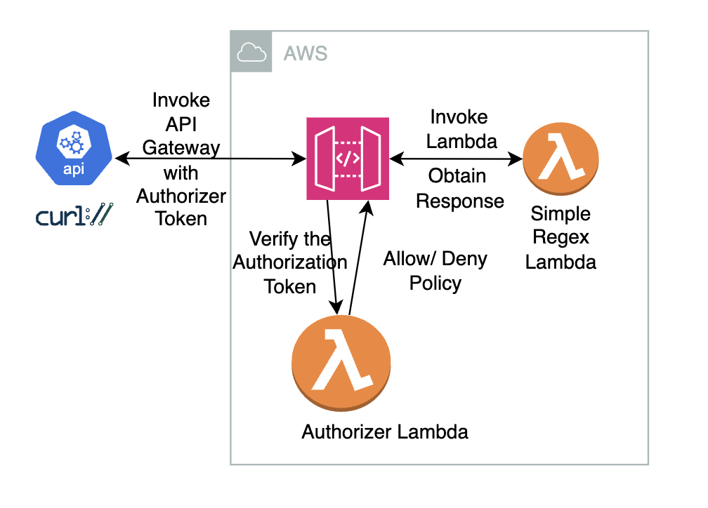

## I had created this **Lambda Endpoint with a Custom Token Authorizer** Recipe with the help of Github CoPilot

- My interactions with CoPilot are in [copilot_interactions.md](./copilot_interactions.md)
- The commands that were run are there in [sam_commands.md](./sam_commands_without_actuals.md)

## What we built: 

